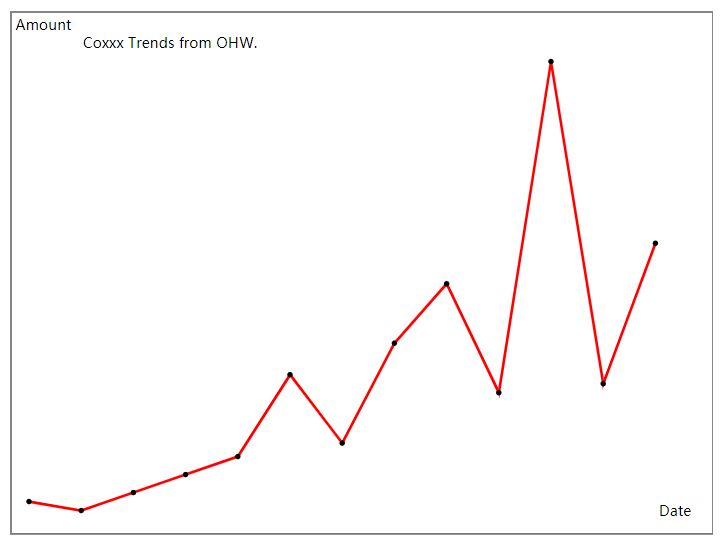

# svg
Basic implement of svg image for web.
## install
`git clone --depth=1 https://github.com/ovlo/svg` or
`git clone --depth=1 https://gitee.com/ovlo/svg`

# Example:

module main

import svg

fn main() {

	mut s := svg.new_svg(800, 600)

	f := [3.0, 1, 5, 9, 13, 31, 16, 38, 51, 27, 100, 29, 60]
	s.trend(f, 'Coxxx Trends from OHW.', 'Date', 'Amount', 'red')
	s.write_file('trend.svg')
  println('view `trend.svg` ...')
  
}
